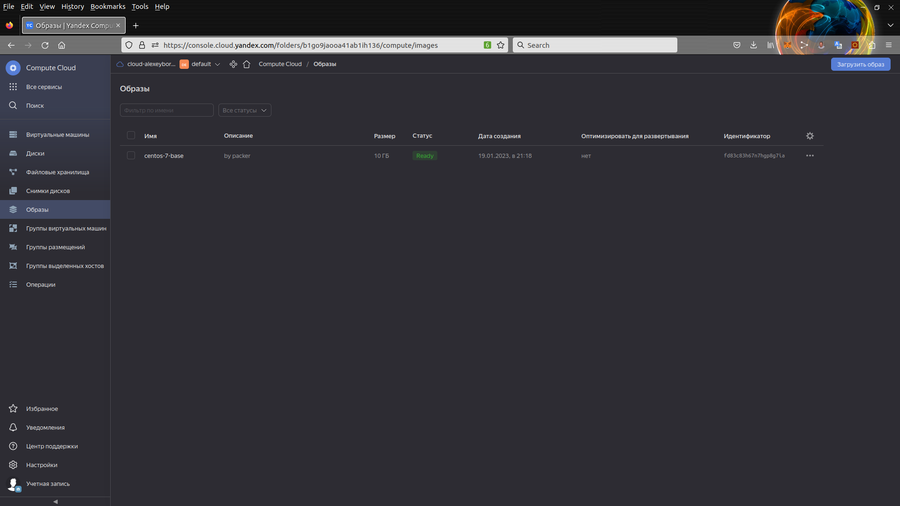
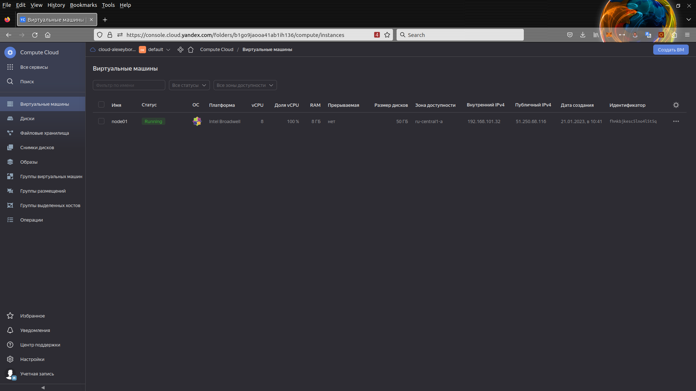
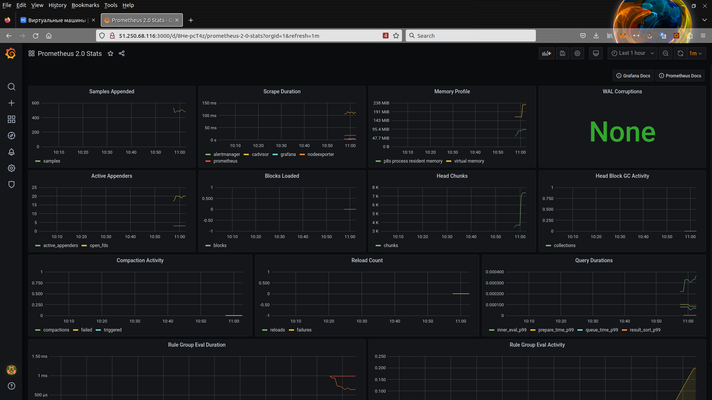
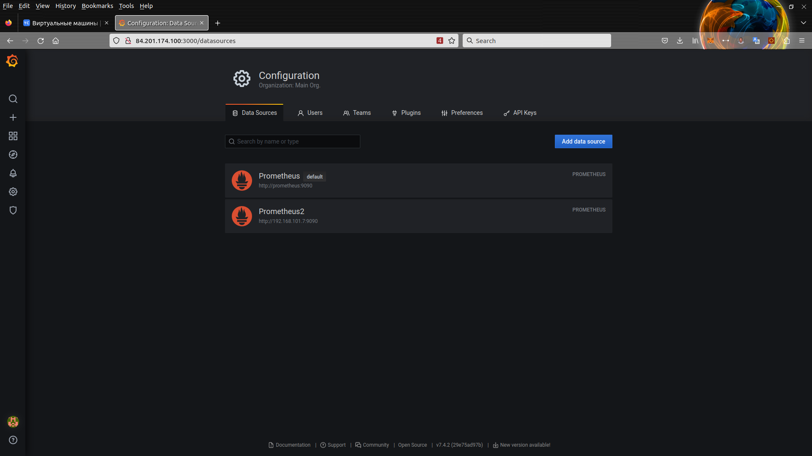
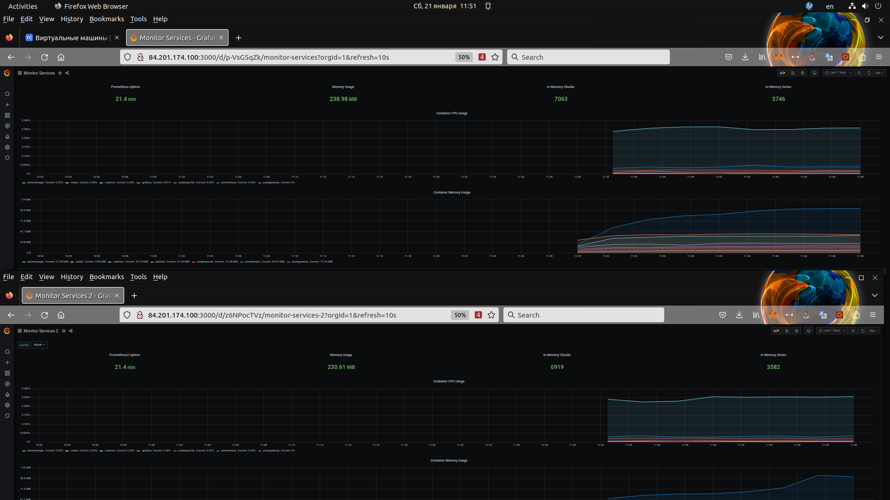

# Домашнее задание к занятию "4. Оркестрация группой Docker контейнеров на примере Docker Compose"

Для выполнения работы используем шаблоны из приложения к домашнему заданию в папке `src`.

Предварительно инициализируем yandex cloud

## Задача 1

Получаем недостающие занчения:

- folder_id
- subnet_id
- token
- zone

Используем команды

```bash

yc config list
yc vpc network list-subnets --name default
```

Проверяем и создаем образ

```bash
packer validate centos-7-base.json
packer build centos-7-base.json
```

Проверяем наличие созданного образа

```console
$ yc compute image list
+----------------------+---------------+--------+----------------------+--------+
|          ID          |     NAME      | FAMILY |     PRODUCT IDS      | STATUS |
+----------------------+---------------+--------+----------------------+--------+
| fd83c83h67n7hgp8g7ia | centos-7-base | centos | f2ei2tsbd97v7jap5rhc | READY  |
+----------------------+---------------+--------+----------------------+--------+
```



## Задача 2

 Заменяем  на свои переменные

 ```console
 # https://console.cloud.yandex.ru/cloud?section=overview
 variable "yandex_cloud_id" {
-  default = "b1gu1gt5nqi6lqgu3t7s"
+  default = "b1g16ur0j0dekbekp8t7"
 }
 
 # Заменить на Folder своего облака
 # https://console.cloud.yandex.ru/cloud?section=overview
 variable "yandex_folder_id" {
-  default = "b1gaec42k169jqpo02f7"
+  default = "b1go9jaooa41ab1ih136"
 }
 
 # Заменить на ID своего образа
 # ID можно узнать с помощью команды yc compute image list
 variable "centos-7-base" {
-  default = "fd8ft6norj68lo29qlpi"
+  default = "fd83c83h67n7hgp8g7ia"
 }
```

Создаем ключ для нашего сервисного аккаунта командой

`yc iam key  create  --output key.json --service-account-id $service-account-id`

Просматирваем и применям Terraform план

```console
terraform plan
terraform apply

...
Apply complete! Resources: 3 added, 0 changed, 0 destroyed.

Outputs:

external_ip_address_node01_yandex_cloud = "51.250.68.116"
internal_ip_address_node01_yandex_cloud = "192.168.101.32"

```

Проверяем доступность машины, оновременно добавляя в `known hosts`

```console
ssh centos@51.250.68.116

[centos@node01 ~]$ uname -a
Linux node01.netology.cloud 3.10.0-1160.81.1.el7.x86_64 #1 SMP Fri Dec 16 17:29:43 UTC 2022 x86_64 x86_64 x86_64 GNU/Linux

```



## Задача 3

В папке ansible в файле inventory прописываем IP адрес созданной машины

```console
node01.netology.cloud ansible_host=51.250.68.116
```

Запускаем исполнение сценария командой 

```bash
ansible-playbook provision.yml

```

Подключаемся к серверу по адресу 51.250.68.116:3000 с учетными данными admin / admin



Удаляем созданную машину `terraform destroy`

## Задача 4 (*)

Дополнительно создаем в папке terraform еще одну ноду
в файле node02.tf

```console
resource "yandex_compute_instance" "node02" {
  name                      = "node02"
  zone                      = "ru-central1-a"
  hostname                  = "node02.netology.cloud"
  allow_stopping_for_update = true

  resources {
    cores  = 8
    memory = 8
  }

  boot_disk {
    initialize_params {
      image_id    = "${var.centos-7-base}"
      name        = "root-node02"
      type        = "network-nvme"
      size        = "50"
    }
  }

  network_interface {
    subnet_id = "${yandex_vpc_subnet.default.id}"
    nat       = true
  }

  metadata = {
    ssh-keys = "centos:${file("~/.ssh/id_rsa.pub")}"
  }
}

```

Добавляем в файл output.tf

```console
8,14d7
< output "internal_ip_address_node02_yandex_cloud" {
<   value = "${yandex_compute_instance.node02.network_interface.0.ip_address}"
< }
< 
< output "external_ip_address_node02_yandex_cloud" {
<   value = "${yandex_compute_instance.node02.network_interface.0.nat_ip_address}"
< }
```

Запускаем

```console
terraform apply

...
external_ip_address_node01_yandex_cloud = "84.201.174.100"
external_ip_address_node02_yandex_cloud = "130.193.50.170"
internal_ip_address_node01_yandex_cloud = "192.168.101.21"
internal_ip_address_node02_yandex_cloud = "192.168.101.7"

```

Проверяем доступность машин по внешнему IP  по протоколу ssh оновременно добавляя в `known hosts`.

Переходим в папуку ansible и вносим машины в iventory

```console
[nodes:children]
manager

[manager]
node01.netology.cloud ansible_host=84.201.174.100
node02.netology.cloud ansible_host=130.193.50.170
```

Запускаем установку ПО `ansible-playbook provision.yml`

Подключаемся к первой машине по адресу 84.201.174.100:3000

Добавляем источник данных Prometheus2  от prometheus  второй машины по внутреннему адресу http://192.168.101.7:9090 с базовой аутенификацией admin/admin



Делаем копию dashboard `Monitor services 2`, меняем в JSON источник данных на Prometheus2

Вид мониторинга представлен на скриншоте



Удаляем созданные машины `terraform destroy`
