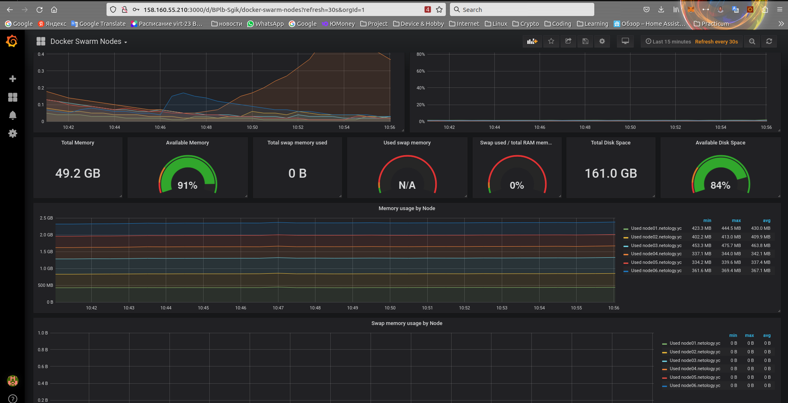

# Домашнее задание к занятию "5. Оркестрация кластером Docker контейнеров на примере Docker Swarm"

---

## Задача 1

Дайте письменые ответы на следующие вопросы:

- В чём отличие режимов работы сервисов в Docker Swarm кластере: replication и global?

Сервис в глобальном режиме будет развернут с одной репликой на каждом узле кластера.

В режиме репликации количество сервисов будет определяться заданными параметрами.

- Какой алгоритм выбора лидера используется в Docker Swarm кластере?

Управляющие узлы выполняют  алгоритм Raft-консенсуса для «выбора» единственного лидера.

- Что такое Overlay Network?

Overlay Network  распределенную сеть между несколькими узлами  Docker. 
Эта сеть находится поверх  сети соединяющей узлы  и  позволяет контейнерам, 
подключенным к ней (включая контейнеры swarm), безопасно обмениваться данными при включенном шифровании.

## Задача 2

Используя исходные данные к домашнуму заданию, 
учетные данные в Яндекс.Облаке и ключ сервисного аккаунта в папке src/terraform выпольныем

```console

terraform apply

....

Apply complete! Resources: 13 added, 0 changed, 0 destroyed.

Outputs:

external_ip_address_node01 = "158.160.55.210"
external_ip_address_node02 = "158.160.48.197"
external_ip_address_node03 = "158.160.56.126"
external_ip_address_node04 = "158.160.56.228"
external_ip_address_node05 = "130.193.39.20"
external_ip_address_node06 = "158.160.55.152"
internal_ip_address_node01 = "192.168.101.11"
internal_ip_address_node02 = "192.168.101.12"
internal_ip_address_node03 = "192.168.101.13"
internal_ip_address_node04 = "192.168.101.14"
internal_ip_address_node05 = "192.168.101.15"
internal_ip_address_node06 = "192.168.101.16"
```

Подключаемся к первой машине в кластере и просматриваем информацию о нодах Docker Swarm

```console
$ ssh centos@158.160.55.210
[centos@node01 ~]$ sudo docker node ls
ID                            HOSTNAME             STATUS    AVAILABILITY   MANAGER STATUS   ENGINE VERSION
hc0h38dtm61h1pso3g8gz25ns *   node01.netology.yc   Ready     Active         Leader           20.10.23
q0ovgpqz9uff216ouopgcreig     node02.netology.yc   Ready     Active         Reachable        20.10.23
pvxvso8ru1l1cohdv0ftafrft     node03.netology.yc   Ready     Active         Reachable        20.10.23
yrm26b0w8quqtd7djajh200dg     node04.netology.yc   Ready     Active                          20.10.23
x85bhn1xesdgcs8oof3ynws38     node05.netology.yc   Ready     Active                          20.10.23
53l11sndz0j0aab70anbc5yfw     node06.netology.yc   Ready     Active                          20.10.23
```

## Задача 3

Подключаемся к к первой машине в кластере

```console
$ ssh centos@158.160.55.210
[centos@node01 ~]$ sudo docker service ls
ID             NAME                                MODE         REPLICAS   IMAGE                                          PORTS
3czkuocf9bd5   swarm_monitoring_alertmanager       replicated   1/1        stefanprodan/swarmprom-alertmanager:v0.14.0    
ququye1x5465   swarm_monitoring_caddy              replicated   1/1        stefanprodan/caddy:latest                      *:3000->3000/tcp, *:9090->9090/tcp, *:9093-9094->9093-9094/tcp
mos62i4do4s2   swarm_monitoring_cadvisor           global       6/6        google/cadvisor:latest                         
4xqnwo23alv3   swarm_monitoring_dockerd-exporter   global       6/6        stefanprodan/caddy:latest                      
wyerukfxt71o   swarm_monitoring_grafana            replicated   1/1        stefanprodan/swarmprom-grafana:5.3.4           
53j25k04z0uc   swarm_monitoring_node-exporter      global       6/6        stefanprodan/swarmprom-node-exporter:v0.16.0   
pgcvdtr79w06   swarm_monitoring_prometheus         replicated   1/1        stefanprodan/swarmprom-prometheus:v2.5.0       
qaqvmg9c41o1   swarm_monitoring_unsee              replicated   1/1        cloudflare/unsee:v0.8.0  
```

 

## Задача 4 (*)

Выполнить на лидере Docker Swarm кластера команду (указанную ниже) и дать письменное описание её функционала, что она делает и зачем она нужна:
```
# см.документацию: https://docs.docker.com/engine/swarm/swarm_manager_locking/
docker swarm update --autolock=true
```

Команда  делает модифицирует swarm и создает блокировку доступа к ключам шифрования после презагрузки docker и так же содает  ключ , который необходим для доступа к docker service.


Пример использования

```bash

# Создаем блокировку и ключ

sudo docker swarm update --autolock=true
Swarm updated.
To unlock a swarm manager after it restarts, run the `docker swarm unlock`
command and provide the following key:

    SWMKEY-1-i8poLUxup+49+RNwLZXmQ/xeXozI4TrQAywobNbW0Ag

Please remember to store this key in a password manager, since without it you
will not be able to restart the manager

# Рестартуем докер

[centos@node01 ~]$ sudo service docker restart
Redirecting to /bin/systemctl restart docker.service

# Пытаемся посмотреть сервисы

[centos@node01 ~]$ sudo docker service ls
Error response from daemon: Swarm is encrypted and needs to be unlocked before it can be used. Please use "docker swarm unlock" to unlock it.

# Видим отсутствие запущенных контейнеров  в докере
[centos@node01 ~]$ sudo docker ps
CONTAINER ID   IMAGE     COMMAND   CREATED   STATUS    PORTS     NAMES

# Разблокируем swarm

[centos@node01 ~]$ sudo docker swarm unlock
Please enter unlock key: 

# Через несколько секунд видим запущенные контейнеры
[centos@node01 ~]$ sudo docker ps 
CONTAINER ID   IMAGE                                          COMMAND                  CREATED         STATUS         PORTS      NAMES
e9a782bc38c1   stefanprodan/caddy:latest                      "/sbin/tini -- caddy…"   4 seconds ago   Up 2 seconds              swarm_monitoring_dockerd-exporter.hc0h38dtm61h1pso3g8gz25ns.s8dqj865ze46hvsjc3ywc8uxm
3d4b3ceaff3f   stefanprodan/swarmprom-node-exporter:v0.16.0   "/etc/node-exporter/…"   4 seconds ago   Up 3 seconds   9100/tcp   swarm_monitoring_node-exporter.hc0h38dtm61h1pso3g8gz25ns.ue9jvsv9zd9a9oqneyby1kdp2
d58fef0f9eb1   google/cadvisor:latest                         "/usr/bin/cadvisor -…"   4 seconds ago   Up 2 seconds   8080/tcp   swarm_monitoring_cadvisor.hc0h38dtm61h1pso3g8gz25ns.eisixizoue4upopcqnm5dmj3p
```


